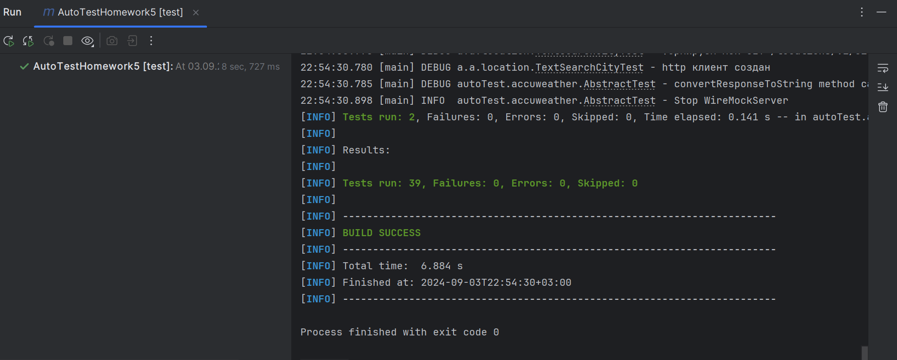
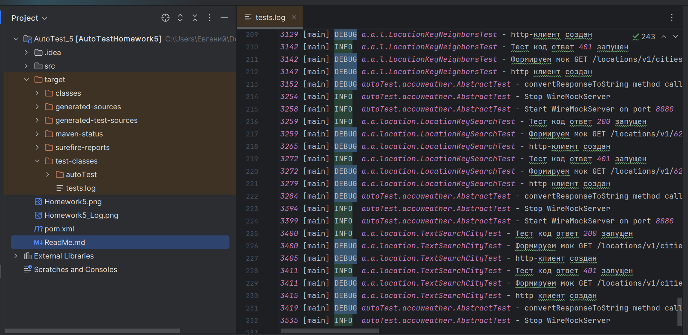

# Семинар: Моки и логи

Вам необходимо:
1. Покрыть 20 запросов тестами используя моки;
2. Подключить библиотеку для логирования;
3. Добавить логи к своему проекту;
4. Запушить проект в GIT.

-----------------------------------------------------------------------
## Test-run проекта

-----------------------------------------------------------------------
## Test-log проекта
